# DialogUtil
material风格(v7支持包中的)，ios风格，自动获取顶层activity,可在任意界面弹出,可在任意线程弹出

[](https://jitpack.io/#hss01248/DialogUtil)

# 注意点
* 在activity已经resume后再调用,不要在onstart里用,否则可能会不显示.
* 如果非要在onstart里,就记得调用setActivity()
* 如果有的国产机不显示,就调用setActivity()
* 不要滥用loadingdialog:

> 注意使用的场景:
 第一此进入页面,用layout内部的loadingview,有很多statelayout框架,也可以用我的这个:
  https://github.com/hss01248/PageStateManager
  再次刷新,用刷新头显示刷新状态
  局部刷新或点击某按钮访问网络,用loading dialog,不影响页面本身状态,类似web中的ajax请求.

# 特性

loading对话框和ios风格的dialog传入context和activity均可弹出dialog.

样式包括常用的ios风格dialog和meterial design风格的dialog.

自定义样式:可以传入自定义的view,定义好事件,本工具负责显示

考虑了显示内容超多时的滑动和与屏幕的间隙.


# 更新

1.ios风格的按钮颜色改成ios的蓝色(图中蓝色不正是因为total control 截图后偏色)

2.按钮添加按下的效果

3.增加meterial design的单选和多选,增加ios风格的输入框

4.增加传入自定义的view(此时工具类作为一个壳,view相关数据样式和回调自己实现.)

## 2016-10-20

1.增加转菊花的loading效果

2.bottomsheet 加上listview和gridview,只需要设置图标和文字

参考:

http://blog.csdn.net/qibin0506/article/details/51002241
http://www.cnblogs.com/warnier-zhang/p/4904296.html
http://www.jianshu.com/p/21bb14e3be94/comments/1570995  坑

https://github.com/android-cjj/BottomSheets


## 2016-11-2

1. 修改: 点击半透明背景处,默认动作改成不消失.(outsideTouchable默认值改成false)
2. 增加: loading对话框--无须对象即可关闭:StyledDialog.dismissLoading()
3. fix bug: 原先的两个loading对话框第一层api设置cancelable和outsideTouchable无效,如今有效.
4. 移除对butterknife的依赖

## 2017-2-15

1.添加获取app顶层activity的工具MyActyManager,从此构建dialog时不用再传特定activity,自动去拿顶层activity使用,同时也规避了miui对TYPE_TOAST的种种限制.

2.调整菊花loading的UI

3.简化所有api,取消context引用的传入.


###  2017-04-06

* 支持任意线程调用

* 支持带进度的dialog,以及进度更新

  ```
  StyledDialog.buildProgress(CharSequence msg,boolean isHorizontal)

  StyledDialog.updateProgress(Dialog dialog, int progress, int max, CharSequence msg,  boolean isHorizontal)
  ```

### 2017-04-10

* loading 对话框更新msg:
```
    StyledDialog.updateLoadingMsg(String msg)

```
### 2017-04-18
* 添加功能: 在指定的activity上弹出dialog:
```
   .setActivity(MainActivity.this)
```
### 2017-04-24
* 适配横屏,平板,以及高低分辨率屏幕
* 解决原先alertdialog的按钮的样式无法自定义的bug. "取消"按钮默认灰色
* 转菊花时,背景变透明,不再有变暗


### 2017-04-25

* 添加背景阴影,优化适配显示

### 2017-04-26

* 简化多选对话框的api和回调

# todo

bottomsheet 图标大小和文字大小的自定义
ios action sheet 加上标题
md 单选多选颜色自定义
md 增加自定义输入框+勾选功能
所有dialog 增加oncancellistener
progressdialog改成完全自定义的
所有dialog : 增加动画的自定义

选择https://github.com/liangchengcheng/android-loading-dialog中的一些好的效果加进来


# 示例图

ios 样式的 loading

```
buildLoading( )
buildLoading( CharSequence msg)

updateLoadingMsg(final String msg)//更新msg
```

 

android 样式的loading

```
buildMdLoading( )
buildMdLoading( CharSequence msg) 

updateLoadingMsg(final String msg)//更新msg
```

  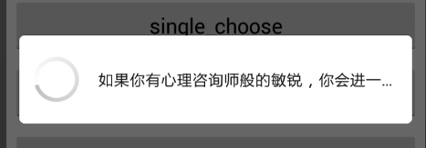

ProgressDialog of horizontal

```
buildProgress( CharSequence msg,boolean isHorizontal)

//更新进度
updateProgress(final Dialog dialog, final int progress, final int max, final CharSequence msg, final boolean isHorizontal)
```

 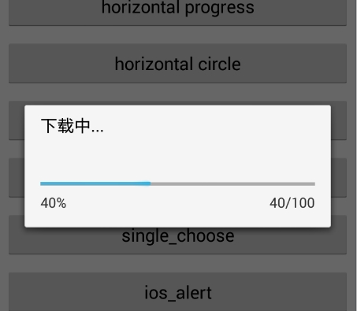

ProgressDialog of spinner,用文字显示的进度(自动计算):

 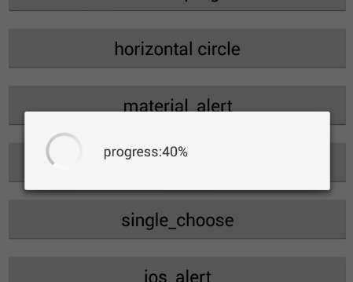

AlertDialog of appcompat-v7

```
buildMdAlert( CharSequence title, CharSequence msg, MyDialogListener listener)
```

 


```
buildMdSingleChoose( CharSequence title, int defaultChosen, CharSequence[] words, MyItemDialogListener listener)
```

 

```
buildMdMultiChoose( CharSequence title, CharSequence[] words, List<Integer> selectedIndexs, MyDialogListener btnListener)
```

 


ios风格(含按下效果)

```
buildIosAlert( CharSequence title, CharSequence msg, MyDialogListener listener)
```

 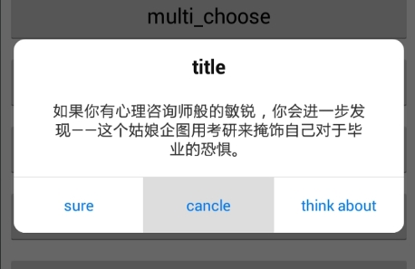


```
buildIosAlertVertical( CharSequence title, CharSequence msg, MyDialogListener listener) 
```

 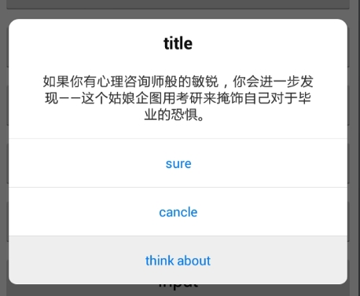

```
buildNormalInput( CharSequence title, CharSequence hint1, CharSequence hint2, CharSequence firstTxt, CharSequence secondTxt, MyDialogListener listener
```

 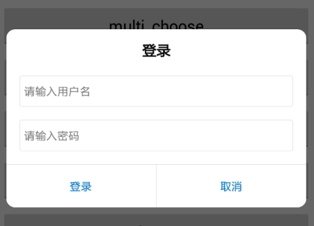


```
buildIosSingleChoose( List<? extends CharSequence> words, MyItemDialogListener listener)
```

 

```
buildBottomItemDialog( List<? extends CharSequence> words, CharSequence bottomTxt, MyItemDialogListener listener)
```

 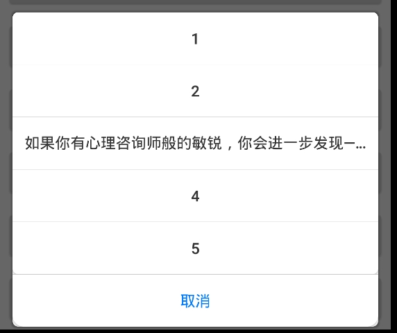


BottomSheetDialog of design

```
buildBottomSheetLv(CharSequence title, List datas, CharSequence bottomTxt, MyItemDialogListener listener)
```

  


```
buildBottomSheetGv( CharSequence title, List datas, CharSequence bottomTxt,int columnsNum ,MyItemDialogListener listener)
```

 


gridview拉出来时:

 


弹出自己定义的一个view:(示例图中有一个webview)

```
 ViewGroup customView = (ViewGroup) View.inflate(this,R.layout.customview,null);
final ConfigBean bean = StyledDialog.buildCustom(customView, Gravity.CENTER);
final Dialog dialog1 =   bean.show();
```

 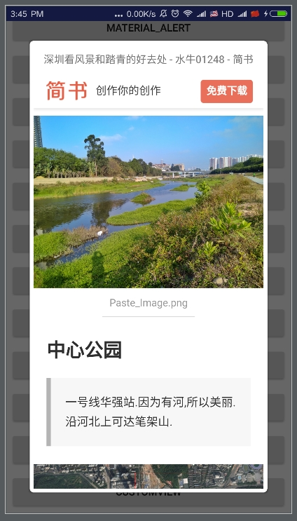


# 适配情况

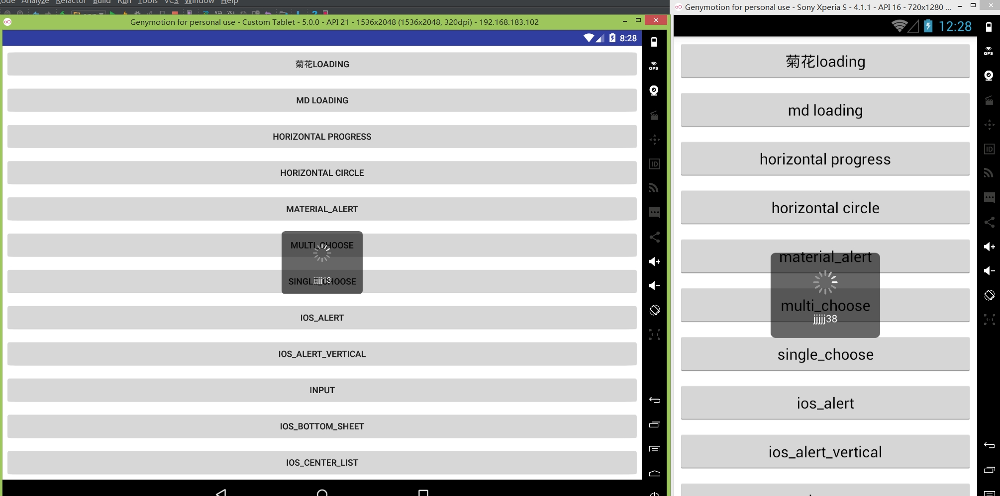


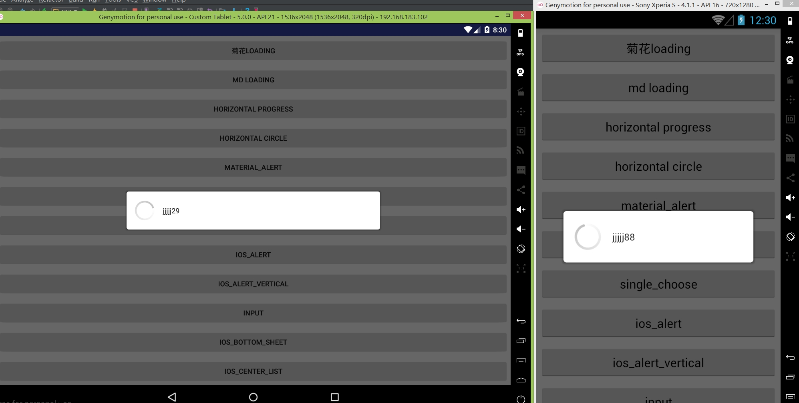

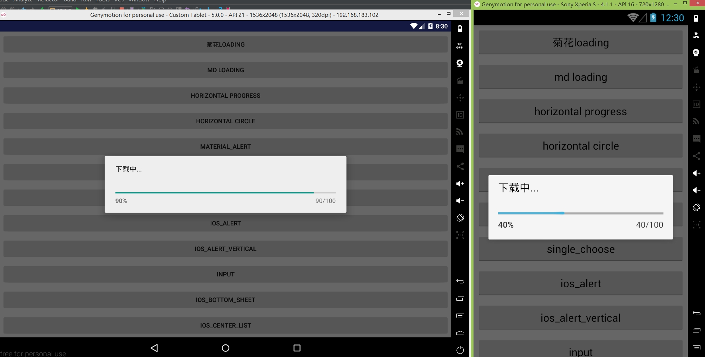


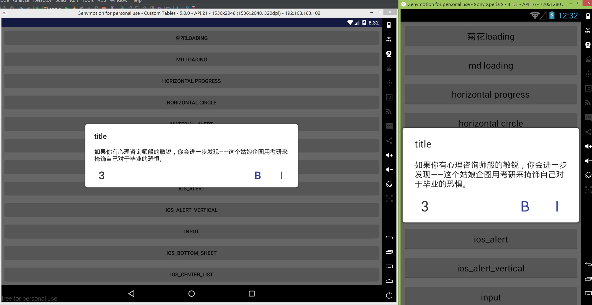

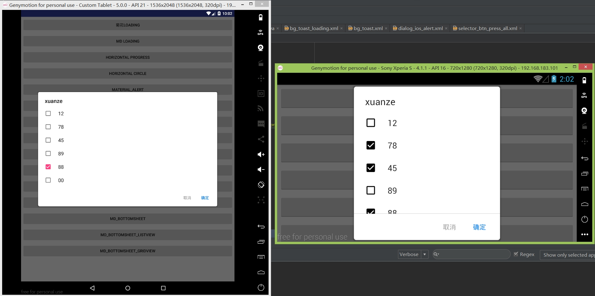

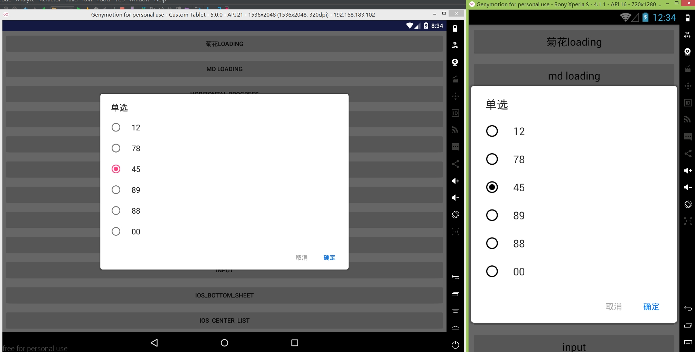


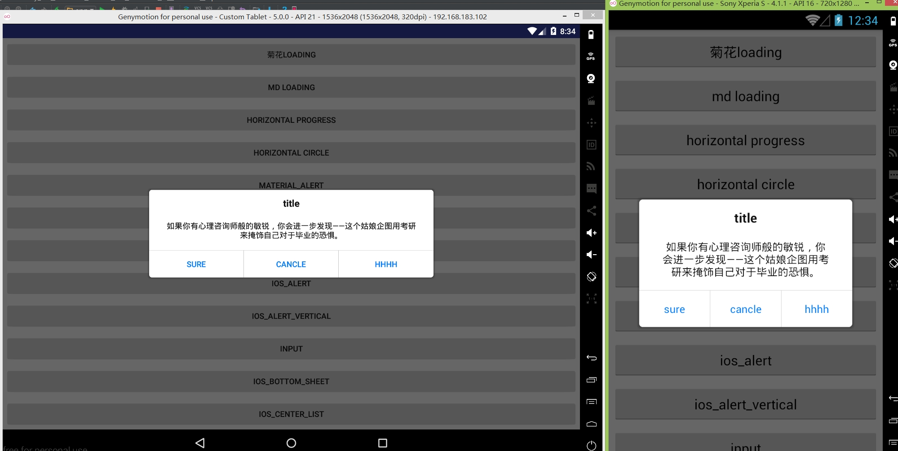


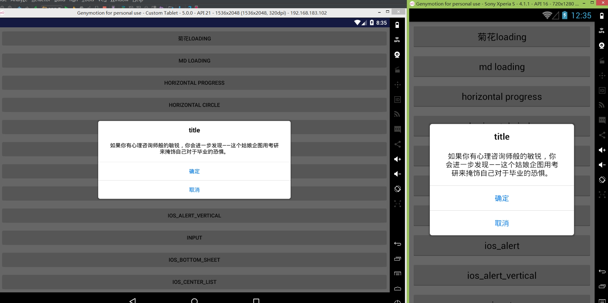


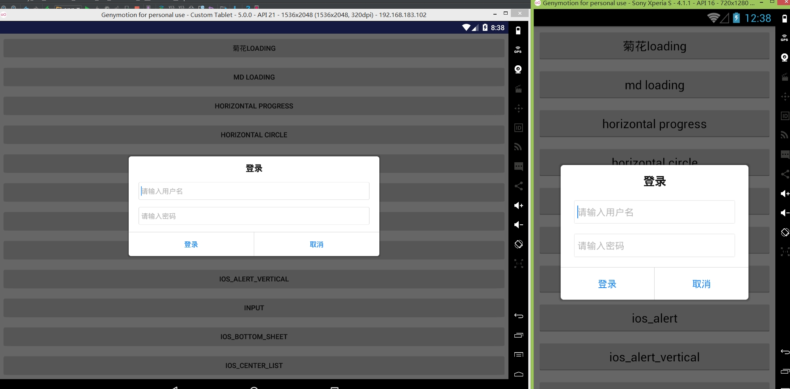


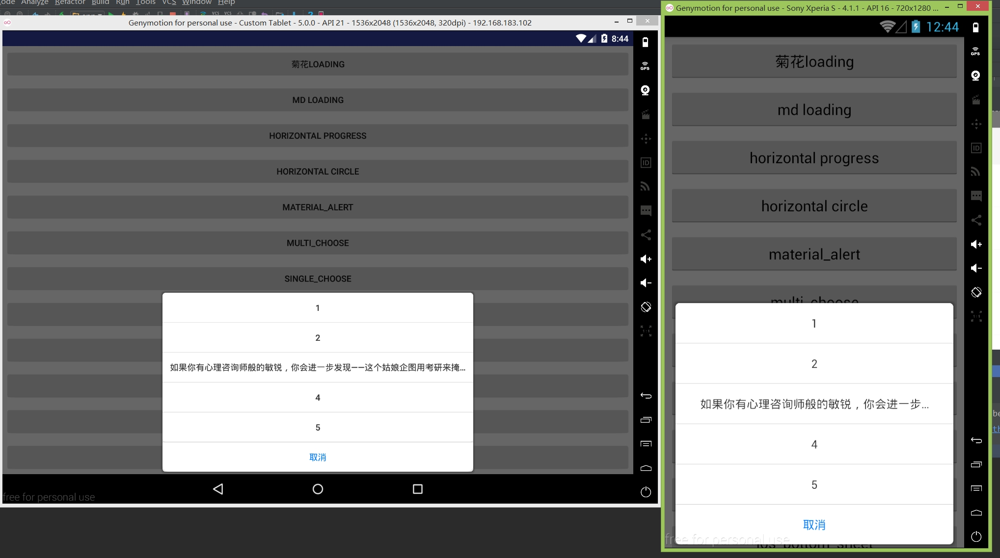


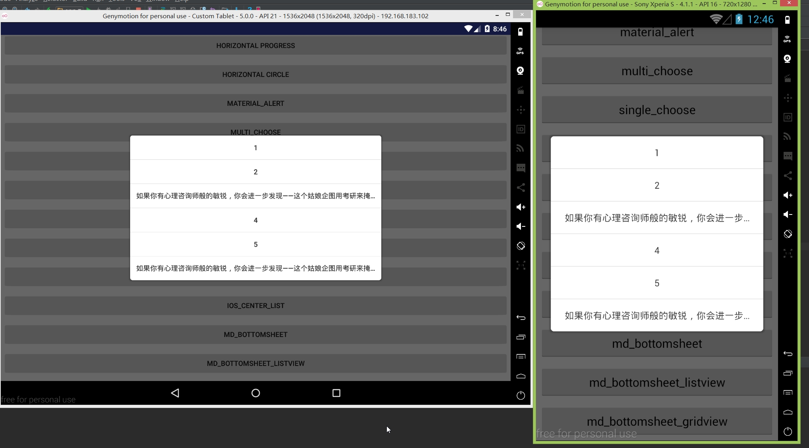


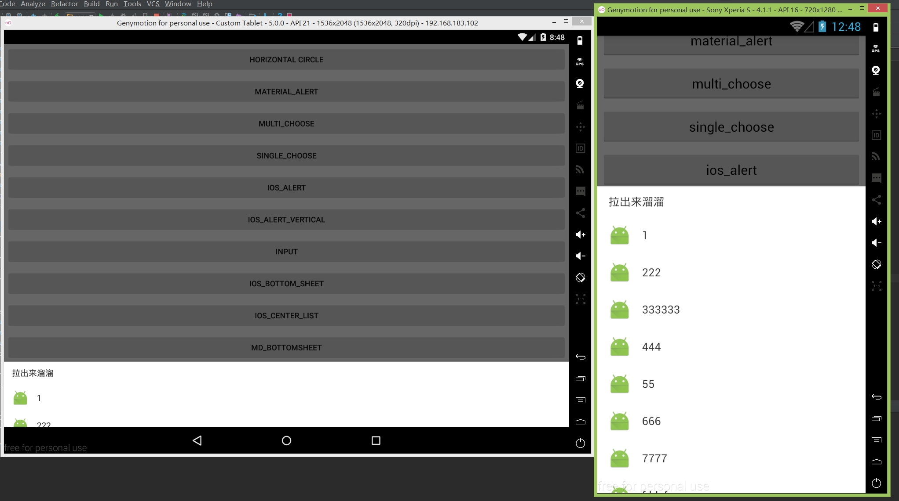


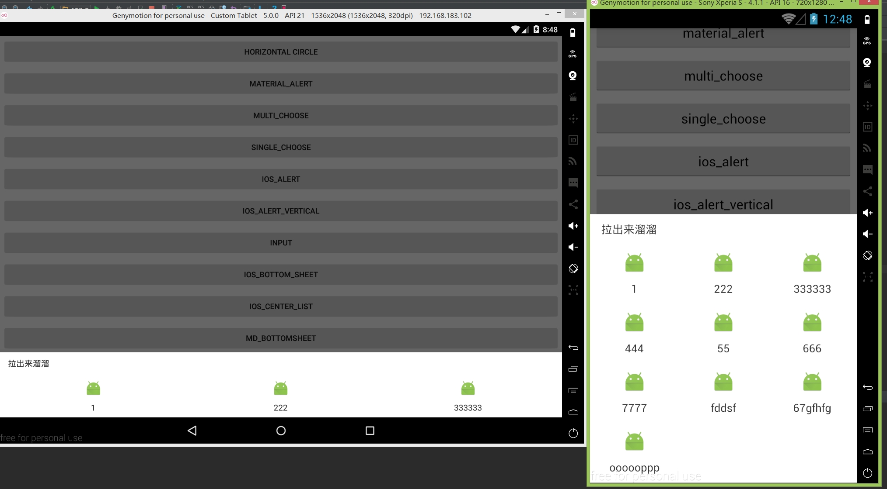

> 当设置不要半透明遮罩-setTransparentBehind(true),或者有的机型上半透明层(dimlayer)不生效时,四周阴影效果如下:

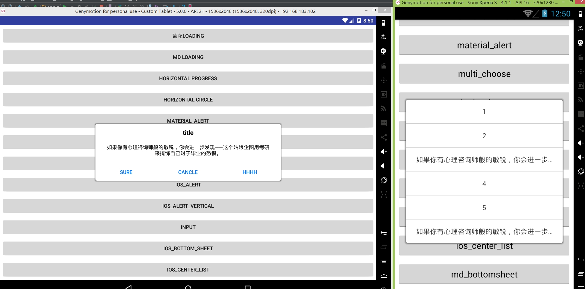


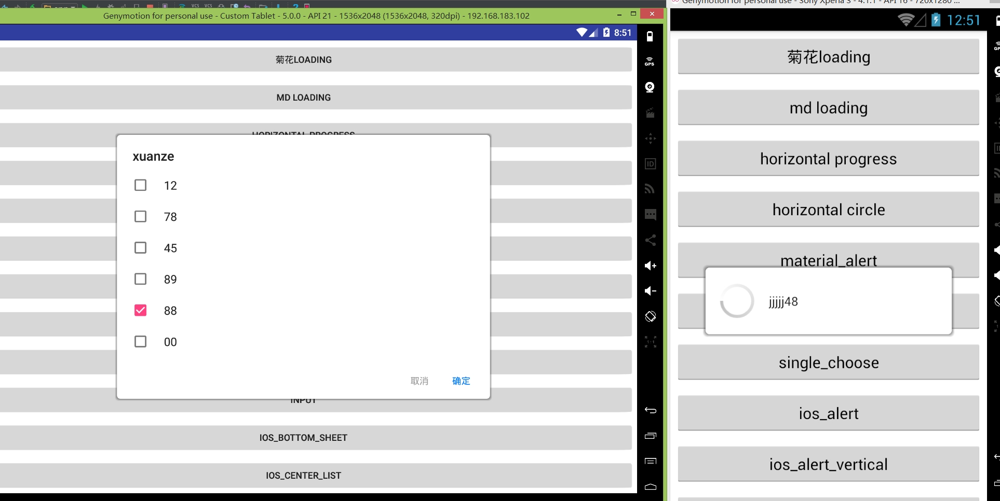


# useage


## gradle

**Step 1.** Add the JitPack repository to your build file

Add it in your root build.gradle at the end of repositories:

```
	allprojects {
		repositories {
			...
			maven { url "https://jitpack.io" }
		}
	}
```

**Step 2.** Add the dependency

```
	dependencies {
	        compile 'com.github.hss01248:DialogUtil:lastest release'
	}
```
lastest release: https://github.com/hss01248/DialogUtil/releases

## 初始化

```
//在Application的oncreate方法里:
传入context
StyledDialog.init(this);

在activity生命周期callback中拿到顶层activity引用:
 registerActivityLifecycleCallbacks(new ActivityLifecycleCallbacks() {
            @Override
            public void onActivityCreated(Activity activity, Bundle savedInstanceState) {

            }

            @Override
            public void onActivityStarted(Activity activity) {

            }

            @Override
            public void onActivityResumed(Activity activity) {
            	//在这里保存顶层activity的引用(内部以软引用实现)
                MyActyManager.getInstance().setCurrentActivity(activity);

            }

            @Override
            public void onActivityPaused(Activity activity) {

            }

            @Override
            public void onActivityStopped(Activity activity) {

            }

            @Override
            public void onActivitySaveInstanceState(Activity activity, Bundle outState) {

            }

            @Override
            public void onActivityDestroyed(Activity activity) {

            }
        });

```

## 示例代码(MainActivity里)

```
        //使用默认样式时,无须.setxxx:
        StyledDialog.buildLoading().show();
        
        //自定义部分样式时:
        StyledDialog.buildMdAlert("title", msg,  new MyDialogListener() {
                    @Override
                    public void onFirst() {
                        showToast("onFirst");
                    }

                    @Override
                    public void onSecond() {
                        showToast("onSecond");
                    }

                    @Override
                    public void onThird() {
                        showToast("onThird");
                    }


                })
                        .setBtnSize(20)
                        .setBtnText("i","b","3")
                        .show();
```

# 相关回调

## MyDialogListener

```
	public abstract void onFirst();//md-确定,ios-第一个
    public abstract void onSecond();//md-取消,ios-第二个
    public void onThird(){}//md-netural,ios-第三个

    public void onCancle(){}

    /**
     * 提供给Input的回调
     * @param input1
     * @param input2
     */
    public void onGetInput(CharSequence input1,CharSequence input2){

    }

    /**
     * 提供给MdSingleChoose的回调
     * @param chosen
     * @param chosenTxt
     */
    public void onGetChoose(int chosen,CharSequence chosenTxt){

    }

    /**
     * 提供给MdMultiChoose的回调
     * @param states
     */
    public void onChoosen( List<Integer> selectedIndex, List<CharSequence> selectedStrs,boolean[] states){

    }
```

## MyItemDialogListener

```
 /**
     * IosSingleChoose,BottomItemDialog的点击条目回调
     * @param text
     * @param position
     */
   public abstract void onItemClick(CharSequence text, int position);


    /**
     * BottomItemDialog的底部按钮(经常是取消)的点击回调
     */
   public void onBottomBtnClick(){}
```


# 提供的api

### 各类dialog的初始参数传递和回调:StyledDialog.buildxxx:

 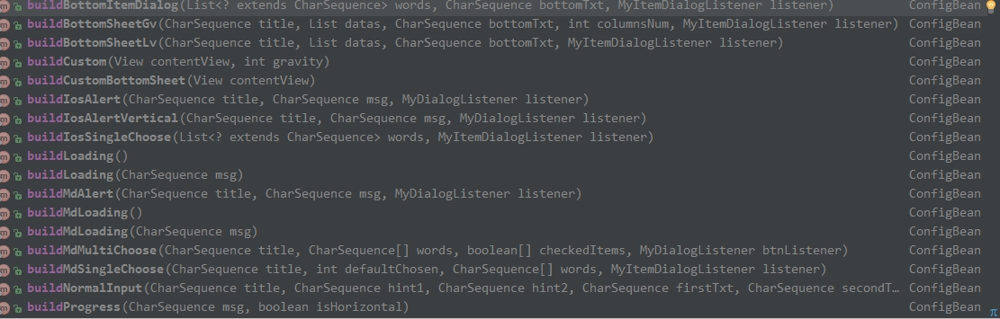


## 自定义样式:setXxx


 

## 最后必须调用show(),返回dialog对象


# 对话框的消失

```
StyledDialog.dismiss(DialogInterface... dialogs);
```


## 两个loading对话框不需要对象就可以直接dismisss:

```
StyledDialog.dismissLoading();
```

### progress dialog 的进度更新

```
/**
 *  可以在任何线程调用
 * @param dialog 传入show方法返回的对象
 * @param progress
 * @param max
 * @param msg 如果是转圈圈,会将msg变成msg:78%的形式.如果是水平,msg不起作用
 * @param isHorizontal 是水平线状,还是转圈圈
 */
public static void updateProgress( Dialog dialog, int progress,  int max,  CharSequence msg,  boolean isHorizontal)
```

