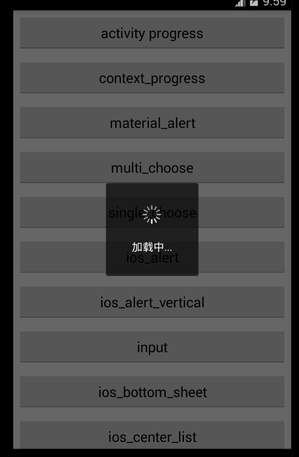
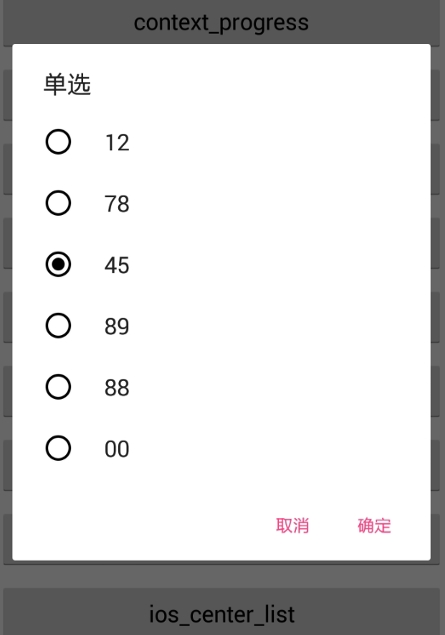
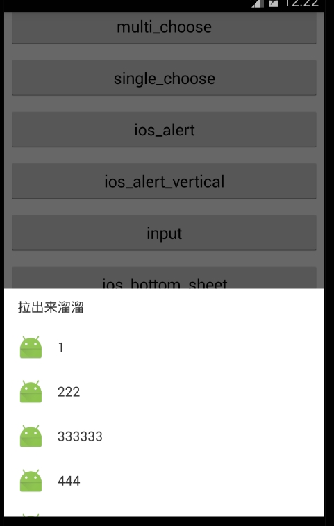
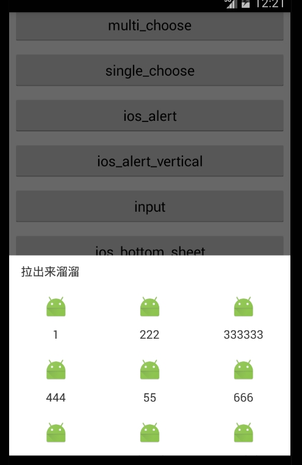
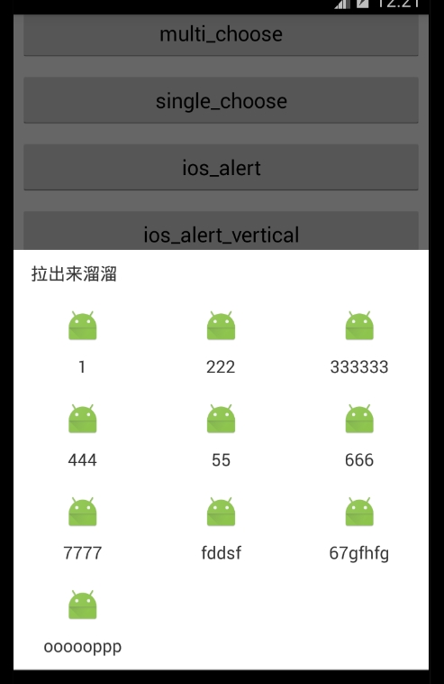
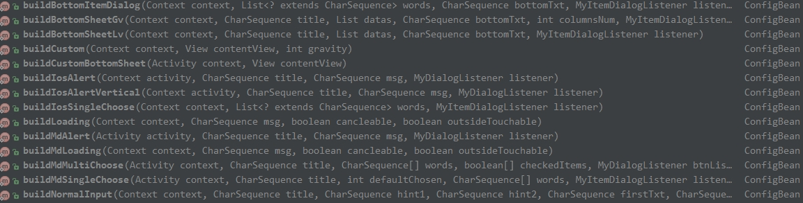
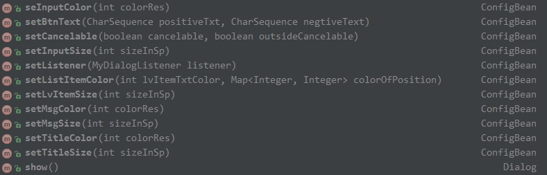

# DialogUtil
material风格(v7支持包中的)，ios风格，自动获取顶层activity,可在任意界面弹出,可在任意线程弹出

[](https://jitpack.io/#hss01248/DialogUtil)

# 特性

loading对话框和ios风格的dialog传入context和activity均可弹出dialog.

样式包括常用的ios风格dialog和meterial design风格的dialog.

自定义样式:可以传入自定义的view,定义好事件,本工具负责显示

考虑了显示内容超多时的滑动和与屏幕的间隙.


# 更新

1.ios风格的按钮颜色改成ios的蓝色(图中蓝色不正是因为total control 截图后偏色)

2.按钮添加按下的效果

3.增加meterial design的单选和多选,增加ios风格的输入框

4.增加传入自定义的view(此时工具类作为一个壳,view相关数据样式和回调自己实现.)

## 2016-10-20

1.增加转菊花的loading效果

2.bottomsheet 加上listview和gridview,只需要设置图标和文字

参考:

http://blog.csdn.net/qibin0506/article/details/51002241
http://www.cnblogs.com/warnier-zhang/p/4904296.html
http://www.jianshu.com/p/21bb14e3be94/comments/1570995  坑

https://github.com/android-cjj/BottomSheets


## 2016-11-2

1. 修改: 点击半透明背景处,默认动作改成不消失.(outsideTouchable默认值改成false)
2. 增加: loading对话框--无须对象即可关闭:StyledDialog.dismissLoading()
3. fix bug: 原先的两个loading对话框第一层api设置cancelable和outsideTouchable无效,如今有效.
4. 移除对butterknife的依赖

## 2017-2-15

1.添加获取app顶层activity的工具MyActyManager,从此构建dialog时不用再传特定activity,自动去拿顶层activity使用,同时也规避了miui对TYPE_TOAST的种种限制.

2.调整菊花loading的UI

3.简化所有api,取消context引用的传入.


###  2017-04-06

* 支持任意线程调用

* 支持带进度的dialog,以及进度更新

  ```
  StyledDialog.buildProgress(CharSequence msg,boolean isHorizontal)

  StyledDialog.updateProgress(Dialog dialog, int progress, int max, CharSequence msg,  boolean isHorizontal)
  ```


# todo


1.windows风格的dialog

2.md风格按钮样式无法自定义的bug

3.bottomsheet 图标大小和文字大小的自定义


# 示例图

ios 样式的 loading

 

android 样式的loading

  

ProgressDialog of horizontal

 

ProgressDialog of spinner,用文字显示的进度(自动计算):

 

AlertDialog of appcompat-v7

 


 


 


ios风格(含按下效果)


 


 


 


 


 


BottomSheetDialog of design

  


 


gridview拉出来时:

 


# useage


## gradle

**Step 1.** Add the JitPack repository to your build file

Add it in your root build.gradle at the end of repositories:

```
	allprojects {
		repositories {
			...
			maven { url "https://jitpack.io" }
		}
	}
```

**Step 2.** Add the dependency

```
	dependencies {
	        compile 'com.github.hss01248:DialogUtil:1.0.5'
	}
```

## 初始化

```
//在Application的oncreate方法里:
传入context
StyledDialog.init(this);

在activity生命周期callback中拿到顶层activity引用:
 registerActivityLifecycleCallbacks(new ActivityLifecycleCallbacks() {
            @Override
            public void onActivityCreated(Activity activity, Bundle savedInstanceState) {

            }

            @Override
            public void onActivityStarted(Activity activity) {

            }

            @Override
            public void onActivityResumed(Activity activity) {
            	//在这里保存顶层activity的引用(内部以软引用实现)
                MyActyManager.getInstance().setCurrentActivity(activity);

            }

            @Override
            public void onActivityPaused(Activity activity) {

            }

            @Override
            public void onActivityStopped(Activity activity) {

            }

            @Override
            public void onActivitySaveInstanceState(Activity activity, Bundle outState) {

            }

            @Override
            public void onActivityDestroyed(Activity activity) {

            }
        });

```

## 示例代码(MainActivity里)

```
        //使用默认样式时,无须.setxxx:
        StyledDialog.buildLoading().show();
        
        //自定义部分样式时:
        StyledDialog.buildMdAlert("title", msg,  new MyDialogListener() {
                    @Override
                    public void onFirst() {
                        showToast("onFirst");
                    }

                    @Override
                    public void onSecond() {
                        showToast("onSecond");
                    }

                    @Override
                    public void onThird() {
                        showToast("onThird");
                    }


                })
                        .setBtnSize(20)
                        .setBtnText("i","b","3")
                        .show();
```


# 提供的api

### 各类dialog的初始参数传递和回调:StyledDialog.buildxxx:

 


## 自定义样式:setXxx




 

## 最后必须调用show(),返回dialog对象


# 对话框的消失

```
StyledDialog.dismiss(DialogInterface... dialogs);
```


## 两个loading对话框不需要对象就可以直接dismisss:

```
StyledDialog.dismissLoading();
```

### progress dialog 的进度更新

```
/**
 *  可以在任何线程调用
 * @param dialog 传入show方法返回的对象
 * @param progress
 * @param max
 * @param msg 如果是转圈圈,会将msg变成msg:78%的形式.如果是水平,msg不起作用
 * @param isHorizontal 是水平线状,还是转圈圈
 */
public static void updateProgress( Dialog dialog, int progress,  int max,  CharSequence msg,  boolean isHorizontal)
```

