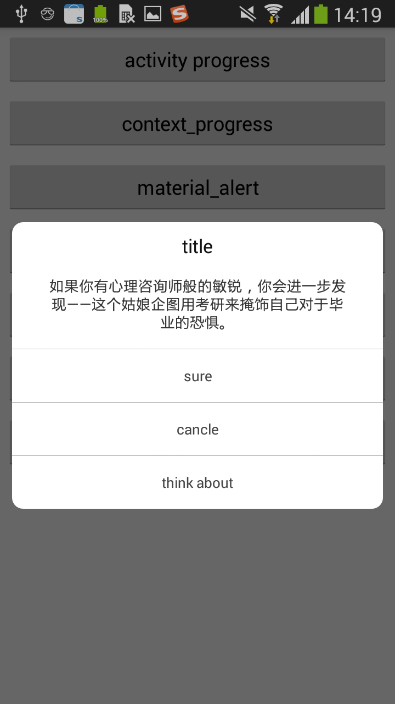
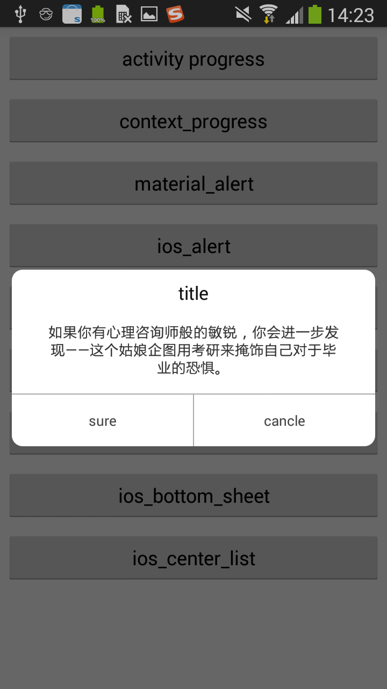
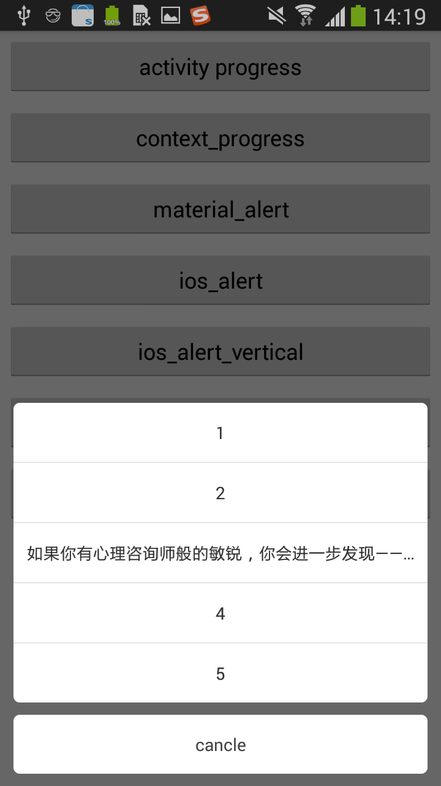
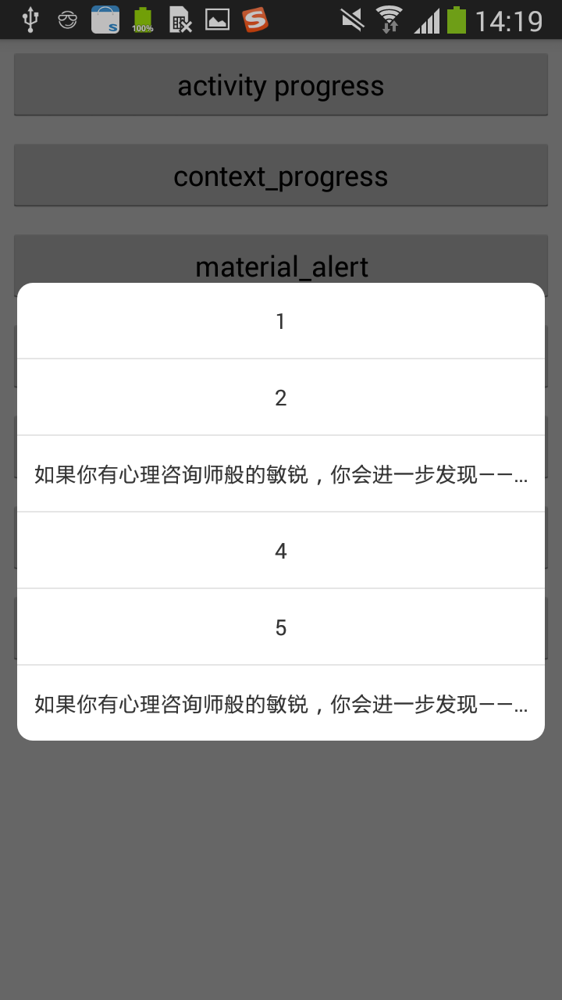

# Deprecated
此库不再维护,新地址请看:[ https://github.com/hss01248/DialogUtil](https://github.com/hss01248/DialogUtil)


# DialogUtils
material风格，ios风格，传入context构建，可在任意界面弹出，以及dialog样式的activity(todo)


# 特性

传入context和activity均可弹出dialog

样式包括常用的ios风格dialog和meterial design风格的dialog.

考虑了显示内容超多时的滑动和与屏幕的间隙.


# 示例图

 


 


 


 


 


 


 


# useage


## gradle

**Step 1.** Add the JitPack repository to your build file

Add it in your root build.gradle at the end of repositories:

```
	allprojects {
		repositories {
			...
			maven { url "https://jitpack.io" }
		}
	}
```

**Step 2.** Add the dependency

```
	dependencies {
	        compile 'com.github.glassLake:DialogUtils:1.0.2'
	}
```


## 示例代码


```
//通过普通的activity 弹出进度条(转圈圈)
StytledDialog.showProgressDialog(this,msg,true,true);

//通过context弹出进度条
gloablDialog=   StytledDialog.showProgressDialog(getApplicationContext(),msg,true,true);

//meterial design 样式的alertdialog:
 StytledDialog.showMdAlert(this, "title", msg, "sure", "cancle", "think about", true, 	true, new MyDialogListener() {
                    @Override
                    public void onFirst(DialogInterface dialog) {
                        showToast("onFirst");
                    }

                    @Override
                    public void onSecond(DialogInterface dialog) {
                        showToast("onSecond");
                    }

                    @Override
                    public void onThird(DialogInterface dialog) {
                        showToast("onThird");
                    }


                });
                
 //ios样式的提示框:( StytledDialog.showIosAlertVertical(...)为按钮竖直方向上排列的对话框)
 
StytledDialog.showIosAlert(this, "title", msg, "sure", "cancle", "think about", true, true, new MyDialogListener() {
                    @Override
                    public void onFirst(DialogInterface dialog) {
                        showToast("onFirst");
                    }

                    @Override
                    public void onSecond(DialogInterface dialog) {
                        showToast("onSecond");
                    }

                    @Override
                    public void onThird(DialogInterface dialog) {
                        showToast("onThird");
                    }


                });
  
  //底部弹出的带或不带取消按钮的弹窗
  
   final List<String> strings = new ArrayList<>();
                strings.add("1");
                strings.add("2");
                strings.add(msg);

	StytledDialog.showBottomItemDialog(activity, strings, "cancle", true, true, new MyItemDialogListener() {
                    @Override
                    public void onItemClick(String text,int position) {
                        showToast(text);
                    }

                    @Override
                    public void onBottomBtnClick() {
                        showToast("onItemClick");
                    }
                });}
  
  
  //中间弹出的条目弹窗
  
   final List<String> strings = new ArrayList<>();
                strings.add("1");
                strings.add("2");
                strings.add(msg);
                
   StytledDialog.showIosSingleChoose(activity, strings, true, true, new MyItemDialogListener() {
                    @Override
                    public void onItemClick(String text,int position) {
                        showToast(text);
                    }

                    @Override
                    public void onBottomBtnClick() {
                        showToast("onItemClick");
                    }
                });
```


## context弹出dialog注意事项

弹出后对后退键的响应需要自己写代码:

```
Dialog gloablDialog;//用一个统一的变量名存引用

@Override
public void onBackPressed() {

    if (gloablDialog != null && gloablDialog .isShowing()){
        gloablDialog.dismiss();
    }else {
        super.onBackPressed();
    }
}


```

